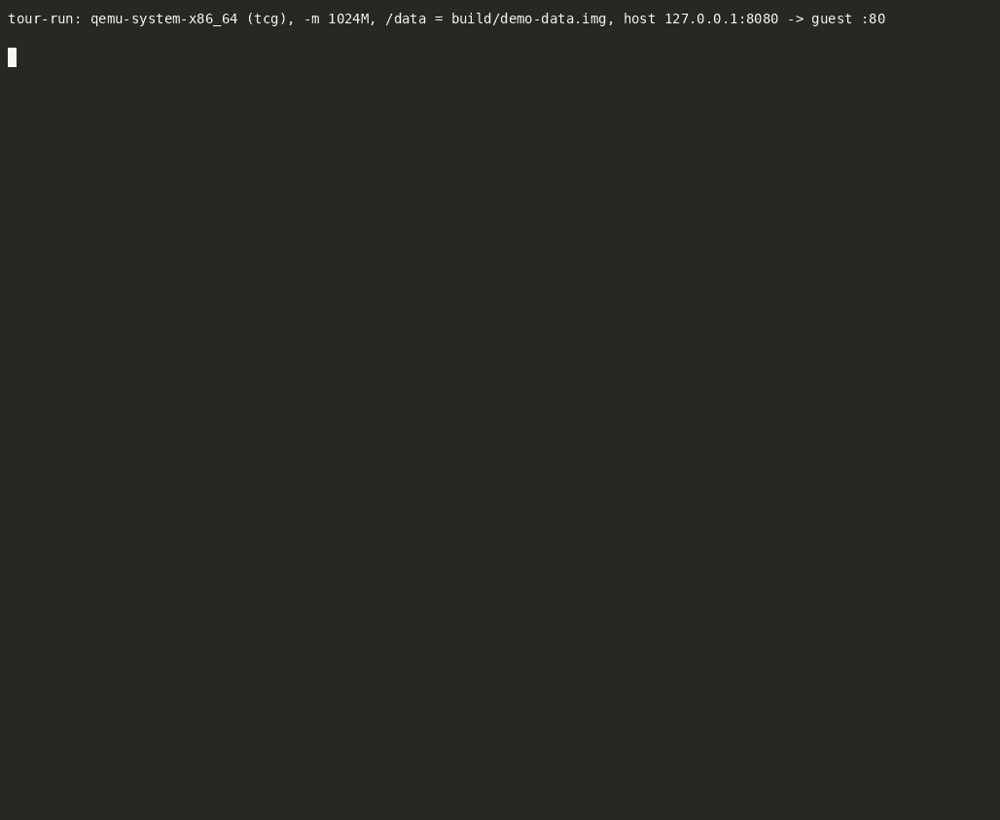

# iron-kernel demos

**iron-kernel** is a Linux-syscall-compatible operating system kernel written
from scratch in Rust (`no_std`, x86-64, with aarch64 and riscv64 ports). It is
not a Linux fork: it has its own paging, scheduler, VFS, signals, namespaces,
cgroups, netfilter, eBPF and TCP/IP stack, and it runs **unmodified Linux
binaries** on top of them, up to and including CRI-O, a kubelet and
kube-proxy.

This repository holds the recordings that show it doing so, and the scripts
that made them.

## 1. The tour — one kernel, 45 seconds

[](https://asciinema.org/a/HJP1QPX6IuBhKFPp)

▶ **[Watch on asciinema.org](https://asciinema.org/a/HJP1QPX6IuBhKFPp)** (sharp,
pausable, and the text is copy-pasteable) · or play [`tour/tour.cast`](tour/tour.cast)
locally with `asciinema play tour/tour.cast`.

The kernel boots under QEMU from a GRUB ISO into a BusyBox initramfs, and a
shell script runs live on the serial console:

| | What you see | What it proves |
|---|---|---|
| 1 | `uname -a`, `/proc/version`, `/proc/cpuinfo`, `/proc/meminfo` | A kernel presenting the Linux ABI and procfs |
| 2 | The kernel's process table, a 100k-line `seq \| awk` pipeline, `yes \| head`, a background `sleep` killed with SIGTERM (exit 143), 100 timed `fork`+`execve` | Processes, pipes, SIGPIPE, signals, `wait4` |
| 3 | An **ext2 disk on virtio-blk** mounted writable at `/data` (a write that persists across boots), a tmpfs mount, symlinks and hardlinks, 16 MiB written, copied and checksummed | VFS, block driver, ext2 read/write, page cache |
| 4 | A static **musl** binary, then a **Go** program passing 21 runtime checks | Unmodified userland: threads, futexes, sockets, eBPF, PTYs |
| 5 | `/proc/ironvisor/{mem,cpus,clock}` | The kernel's own instrumentation |
| 6 | `unshare -u`, `unshare -p` (the shell becomes pid 1), a `chroot` jail, and `/memhog` **OOM-killed at a 32 MiB cgroup limit** (exit 137) | Namespaces, chroot, cgroup v2 |
| 7 | Routes, `ping` to the gateway, BusyBox `httpd` fetched over loopback and `eth0`, then **the host fetches the page through QEMU's port forward** | The kernel's smoltcp-based TCP/IP stack on virtio-net, inbound and outbound |

Everything in it ships with the kernel repository; nothing is staged. The
recording was made under TCG (no KVM) in a 4-vCPU container.

### Reproduce it

From the iron-kernel repository, with its normal build toolchain (Rust
nightly, gcc, grub, xorriso, cpio, QEMU):

```sh
make demo        # boot the tour and watch it on your terminal
make demo-cast   # the same, recorded with asciinema into demo/tour.cast
```

The pieces, copied here for reference:

- [`tour/demo-tour.sh`](tour/demo-tour.sh) — the guest side. BusyBox `ash`,
  run by the kernel's init when it boots with the `demo` token.
- [`tour/tour-run.sh`](tour/tour-run.sh) — the host side. Boots the ISO under
  QEMU (KVM if available, else TCG) with user-mode networking and the repo's
  ext2 test disk, relays the serial console, and makes the host-side HTTP
  request when the guest says `### HTTPD READY ###`.
- [`tour/tour.cast`](tour/tour.cast) — the recording (asciicast v2, 120x42);
  [`tour/tour.gif`](tour/tour.gif) is it rendered with
  `agg --theme monokai --font-size 14 --idle-time-limit 2`.

## 2. The Kubernetes capstone


A real **kube-apiserver + kube-scheduler place a Deployment (replicas=2)** on
a node whose kubelet and CRI-O run both pods, and a real **kube-proxy**
programs their **ClusterIP Service** into the kernel's own netfilter. Then 24
requests to the ClusterIP come back `200 OK` from the pods, load-balanced
through the kernel's DNAT + on-node hairpin + conntrack datapath.

This one needs a KVM host running the control plane and a Debian rootfs with
the Kubernetes binaries; [`kubernetes-capstone/README.md`](kubernetes-capstone/README.md)
has the setup and the scripts
([`demo.sh`](kubernetes-capstone/demo.sh) is the guest's narrated tour,
[`demo-run.sh`](kubernetes-capstone/demo-run.sh) the host's recorder).
The cast is [`kubernetes-capstone/demo.cast`](kubernetes-capstone/demo.cast).

## What else works

Beyond what the two recordings show: Debian 13 boots from an ext2 disk root
with a real `agetty`/`bash` login over serial; dynamically-linked glibc
binaries run through `ld.so`; CoreDNS runs as a pod and Services resolve by
name; `NetworkPolicy` objects are reconciled into in-kernel drop rules; a
sound eBPF verifier feeds an x86-64 JIT; and the aarch64 port runs as a
Kubernetes node on a Raspberry Pi 5 under KVM.

---

*Built with substantial help from Claude (Anthropic) as a pair-programming
collaborator.*
