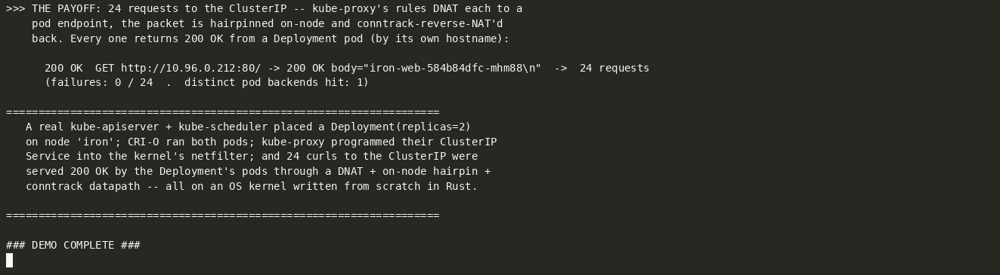
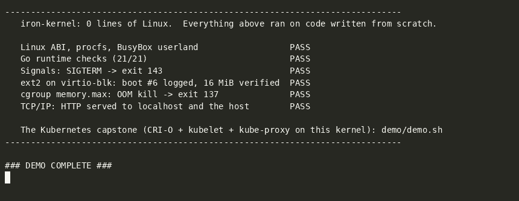

# iron-kernel demos

**iron-kernel** is an operating system kernel written from scratch in Rust
that speaks the Linux system-call ABI. It is not a Linux fork and contains no
Linux code: its paging, scheduler, VFS, signals, namespaces, cgroups,
netfilter, eBPF and TCP/IP stack are its own, and **unmodified Linux
binaries** run on them: BusyBox, glibc and musl programs, Go, and all the way
up to CRI-O, a kubelet and kube-proxy.

The kernel's source is not public. These recordings are what it does.

**▶ Play the recordings:** [dsouzae.github.io/iron-kernel-demos](https://dsouzae.github.io/iron-kernel-demos/)
— an asciinema player served from this repository (pausable, text selectable;
no third-party upload). The transcripts are below, in full.

---

## A real Kubernetes node, on a kernel that is not Linux

A real **kube-apiserver + kube-scheduler** place a `Deployment` (replicas=2)
on node `iron`. The node's **kubelet** and **CRI-O** run both pods. A real
**kube-proxy** programs the pods' **ClusterIP Service** into the kernel's own
netfilter. Then 24 requests to the ClusterIP come back `200 OK` from the
pods, load-balanced through the kernel's DNAT, on-node hairpin and conntrack
reverse-NAT.

[](https://dsouzae.github.io/iron-kernel-demos/#kubernetes)

All of that userland is stock: Debian 13, the upstream Kubernetes and CRI-O
binaries, unmodified. Only the kernel underneath is new.

Details, the scripts and the asciicast: [`kubernetes-capstone/`](kubernetes-capstone/README.md).

---

## The 40-second tour

The same kernel, booting a BusyBox initramfs under QEMU, running a shell
script live on its serial console. Six beats, each ending in a line you can
check without knowing the kernel, and a scoreboard.

[](https://dsouzae.github.io/iron-kernel-demos/#tour)

Transcript (click a section to expand it):

<details>
<summary><b>Boot</b> — GRUB loads the kernel by Multiboot2; it sets up memory, finds the virtio NIC and disk, mounts the initramfs and starts init. Ten of the ~60 boot lines are shown.</summary>

```text
  iron-kernel v0.1.0 - x86_64
Physical memory: 257187 frames free (1004 MB)
Heap initialized: 256000 KB at 0xffffc00000000000
virtio-blk: device 0 initialized, 512 sectors 
virtio-net: MAC 52:54:00:12:34:56
TCP/IP: stack initialized (10.0.2.15, gw 10.0.2.2, + lo 127.0.0.1)
Hardware initialized.
root: cpio initramfs
datadisk: virtio-blk 0 mounted RW at /data: ext2 
Init process created (pid 1).

==============================================================================
   iron-kernel: an OS kernel written from scratch in Rust, speaking Linux
   x86_64 . no_std . GRUB/Multiboot2 . QEMU . BusyBox initramfs . Go init
==============================================================================
```

</details>

<details>
<summary><b>1. It presents the Linux ABI</b> — `uname`, procfs, a BusyBox shell.</summary>

```text
>>> 1. It is a real kernel presenting the Linux system-call ABI

  $ uname -a
Linux iron-kernel 6.1.0 #1 SMP iron-kernel x86_64 GNU/Linux

  $ grep -E 'MemTotal|MemFree' /proc/meminfo; echo nproc=$(nproc)
MemTotal:      1048048 kB
MemFree:       749724 kB
nproc=1
```

</details>

<details>
<summary><b>2. Unmodified binaries run on it</b> — A static musl C program, then a Go program whose runtime needs threads, futexes, signals, sockets, eBPF and a PTY from the kernel. 21 of 21 checks pass.</summary>

```text
>>> 2. Unmodified binaries run on it: static musl C, then the Go runtime

  $ /musl-hello
Hello from musl libc on iron-kernel!
System: Linux iron-kernel 6.1.0
PID: 10

  $ /go-hello
uts: pid 12 sethostname 'iron-kernel' in utsns 0
[OK] 1. Goroutines: 16 goroutines, counter=16
[OK] 2. Runtime: CPUs=1 procs=1 goroutines=1
[OK] 3. Hostname: iron-kernel
[OK] 4. Time: 1791139980 sec since boot
[OK] 5. File I/O: write+read
[OK] 6. File append: iron-kernel! appended
[OK] 7. Directory: 3 entries: [sub a.txt b.txt]
[OK] 8. procfs meminfo
[OK] 9. procfs cpuinfo
[OK] 10. Cgroups: memory.max=1GB
[OK] 11. ext2: Hello from ext2 filesystem!
[OK] 12. Unix socket
[OK] 13. TCP loopback
[OK] 14. eBPF: map+prog
[OK] 15. Readdir /: etc,hello,go-init,dev,go-hello,usr,init,tmp,memhog,testhelper,demo-tour.sh,o
[OK] 16. PID: pid=12
[OK] 17. Pipe: pipe!
[OK] 18. Env
[OK] 19. Stat: size=21
[OK] 20. Seek: read 'kernel!' after seek(5)
[OK] 21. PTY: pts/0: 'hello pty!'
  Results: 21/21 tests passed
```

</details>

<details>
<summary><b>3. Processes</b> — A 100,000-line `seq | awk` pipeline; a background `sleep` killed with SIGTERM comes back as exit 143; 100 `fork`+`execve` cycles, timed.</summary>

```text
>>> 3. Processes: pipelines, signals, and 100 fork+execve cycles

  $ seq 1 100000 | awk '{ s += $1 } END { print "sum of 1..100000 =", s }'
sum of 1..100000 = 5000050000

  $ sleep 30 & P=$!; kill -TERM $P; wait $P; echo "sleep exited with $? (128+15 = SIGTERM)"
sleep exited with 143 (128+15 = SIGTERM)

  $ time sh -c 'for i in $(seq 100); do /bin/true; done'
real	0m 3.20s
```

</details>

<details>
<summary><b>4. A real disk</b> — An ext2 filesystem on a virtio-blk device, mounted writable at `/data`. The boot log it appends to survives reboots; 16 MiB written through the page cache checksums identically on both sides.</summary>

```text
>>> 4. A real disk: ext2 over virtio-blk, writable, persistent across boots

  $ grep ' /data ' /proc/mounts
/dev/vda /data ext2 rw,relatime 0 0

  $ echo "booted $(date)" >> /data/visits.log && sync && cat /data/visits.log
booted Sun Oct  4 17:42:41 UTC 2026
booted Sun Oct  4 17:44:22 UTC 2026
booted Sun Oct  4 18:48:56 UTC 2026
booted Sun Oct  4 18:50:18 UTC 2026
booted Sun Oct  4 18:51:46 UTC 2026
booted Sun Oct  4 18:53:10 UTC 2026

  $ dd if=/dev/urandom of=/tmp/blob bs=1M count=16 2>/dev/null; cp /tmp/blob /data/blob; sync

  $ md5sum /tmp/blob /data/blob
5656ac2f34670ec59ab46a111dcf8371  /tmp/blob
5656ac2f34670ec59ab46a111dcf8371  /data/blob
```

</details>

<details>
<summary><b>5. Container primitives</b> — A new UTS namespace with its own hostname, a new PID namespace where the shell is pid 1, and a cgroup v2 memory limit: `memhog` joins a 32 MiB cgroup, allocates past it and is OOM-killed, exit 137, not a stray segfault.</summary>

```text
>>> 5. Container primitives: namespaces, and a cgroup v2 memory limit enforced

  $ unshare -u sh -c 'hostname pod-a; echo "in a new UTS namespace: $(hostname)"'
uts: pid 146 sethostname 'pod-a' in utsns 1
in a new UTS namespace: pod-a

  $ echo "outside it, still: $(hostname)"
outside it, still: iron-kernel

  $ unshare -p -f sh -c 'echo "in a new PID namespace: the shell is pid $$"'
in a new PID namespace: the shell is pid 1

  $ mkdir /sys/fs/cgroup/oomtest; echo 33554432 > /sys/fs/cgroup/oomtest/memory.max  # 32 MiB
  $ /memhog   # joins the cgroup, then mmaps and touches 1 MiB chunks forever
OOM: killing pid 152 (/memhog), every thread of it, from tid 152: out of physical memory [SIGKILL]
memhog exited with 137  (137 = SIGKILL from the OOM killer at the cgroup limit)
```

</details>

<details>
<summary><b>6. Its own TCP/IP stack</b> — `ping` out to the gateway over virtio-net; BusyBox `httpd` serves a page over loopback; then the host fetches that page through QEMU's port forward, a request entering the kernel's TCP stack from outside the VM.</summary>

```text
>>> 6. Its own TCP/IP stack on virtio-net: ping out, serve HTTP in

  $ ping -c 2 10.0.2.2 | tail -2
2 packets transmitted, 2 packets received, 0% packet loss
round-trip min/avg/max = 0.718/3.510/6.303 ms

  $ httpd -p 80 -h /www && wget -q -O - http://127.0.0.1/ | head -1
<html><body><h1>Hello from iron-kernel</h1>

>>> and now the HOST fetches that page through QEMU's port forward (127.0.0.1:8080 -> :80):

  host$ curl -i http://127.0.0.1:8080/
  HTTP/1.1 200 OK
  Date: Sun, 04 Oct 2026 18:53:17 GMT
  Connection: close
  Content-type: text/html
  Accept-Ranges: bytes
  Last-Modified: Sun, 04 Oct 2026 18:53:17 GMT
  ETag: "6ac2a09d-cd"
  Content-Length: 205
  
  <html><body><h1>Hello from iron-kernel</h1>
  <p>Served by BusyBox httpd on a kernel written from scratch in Rust:
  its own virtio-net driver, TCP/IP stack, sockets, poll, fork and execve.</p>
  </body></html>
```

</details>

<details>
<summary><b>Scoreboard</b> — One PASS/FAIL line per beat, computed inside the guest from what actually happened.</summary>

```text
------------------------------------------------------------------------------
   iron-kernel: 0 lines of Linux.  Everything above ran on code written from scratch.

   Linux ABI, procfs, BusyBox userland                  PASS
   Go runtime checks (21/21)                            PASS
   Signals: SIGTERM -> exit 143                         PASS
   ext2 on virtio-blk: boot #6 logged, 16 MiB verified  PASS
   cgroup memory.max: OOM kill -> exit 137              PASS
   TCP/IP: HTTP served to localhost and the host        PASS

   The Kubernetes capstone (CRI-O + kubelet + kube-proxy on this kernel): demo/demo.sh
------------------------------------------------------------------------------
```

</details>

The recording: [`tour/tour.cast`](tour/tour.cast) (`asciinema play tour/tour.cast`),
also as [`tour/tour.gif`](tour/tour.gif) and one GIF per section in
[`tour/gifs/`](tour/gifs/). Recorded under QEMU TCG, no KVM, in a 4-vCPU
container; the kernel boots to the tour in about ten seconds there.

### What made it

Copied here for reference; they run from the kernel's own build tree.

- [`tour/demo-tour.sh`](tour/demo-tour.sh): the guest side, BusyBox `ash`,
  run by the kernel's init when it boots with the `demo` token.
- [`tour/tour-run.sh`](tour/tour-run.sh): the host side. Boots the ISO under
  QEMU with user-mode networking and the ext2 test disk, relays the serial
  console (boot chatter trimmed to a few lines), makes the host-side HTTP
  request when the guest says `### HTTPD READY ###`.
- [`tour/split-cast.py`](tour/split-cast.py): cuts the asciicast at each
  section heading and renders the pieces with
  [`agg`](https://github.com/asciinema/agg).
- [`docs/`](docs/): the player page, served by GitHub Pages from this branch.

---

## Beyond the recordings

Debian 13 boots from an ext2 disk root into a real `agetty`/`bash` login over
serial; dynamically-linked glibc binaries run through `ld.so`; CoreDNS runs
as a pod and Services resolve by name; `NetworkPolicy` objects are reconciled
into in-kernel drop rules; a sound eBPF verifier feeds an x86-64 JIT; and the
aarch64 port runs as a Kubernetes node on a Raspberry Pi 5 under KVM.

---

*Built with substantial help from Claude (Anthropic) as a pair-programming
collaborator.*
